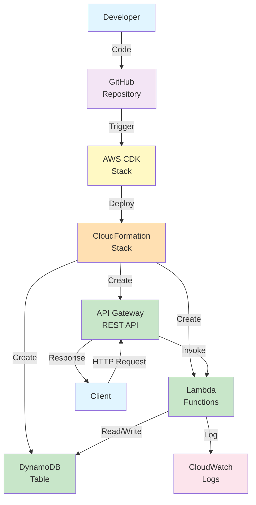

# Welcome to your CDK Python project!

Despliegue en AWS (AWS CDK)
Esta implementación despliega la infraestructura serverless en tu cuenta de AWS.
Prerrequisitos
AWS CLI configurada (aws configure)
Node.js y npm
AWS CDK (npm install -g aws-cdk)
Python 3.10+
Pasos
Mover al directorio de CDK:
cd cdk-interactions-api

Instalar dependencias y activar entorno virtual:
python3 -m venv .venv
source .venv/bin/activate
pip install -r requirements.txt

Bootstrap (Solo la primera vez):
cdk bootstrap

Desplegar el Stack:
cdk deploy

Cargar Datos de Prueba:
Una vez desplegado, ve a la consola de AWS -> DynamoDB -> Tablas -> Interactions.
Crea manualmente los elementos de prueba (ver load_data.py como referencia).
Probar la API Desplegada:
Obtén la URL de la API de la salida de cdk deploy.
API_URL="<pega_tu_url_de_api_gateway_aqui>"

curl -X GET "$API_URL/interactions/123456789"

## Architecture Diagram

